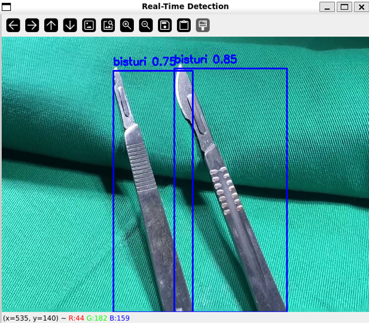

# **Surgical Instrument Detection**

O **DP-Surgical-Instruments-Model** é um projeto focado na detecção em tempo real de instrumentos cirúrgicos utilizando técnicas de aprendizado profundo. Esse modelo pode ser utilizado em salas de cirurgia para rastreamento de ferramentas, auxiliando na gestão eficiente dos instrumentos e melhorando os fluxos de trabalho cirúrgicos.



## **Table of Contents**

- [Overview](#overview)
- [Architecture](#architecture)
- [Dataset](#dataset)
- [Installation](#installation)
- [Configuration](#configuration)
- [Project Structure](#project-structure)
- [Real-Time Detection Execution](#real-time-detection-execution)
- [Environment Variables](#environment-variables)
- [Dependencies](#dependencies)

---

## **Overview**

**DP-Surgical-Instruments-Model** utiliza o modelo **YOLOv8** para detectar instrumentos cirúrgicos em tempo real a partir de vídeos. Ele processa vídeos e fornece informações sobre a detecção para aumentar a eficiência cirúrgica e reduzir erros.

### **Principais Recursos**:
1. Detecção em tempo real de instrumentos cirúrgicos.
2. Métricas de desempenho como precisão, recall e F1-score.
3. Visualização de matrizes de confusão, curvas de precisão-recall e previsões.
4. Pipeline de treinamento personalizável para novos datasets.

---

## **Architecture**

A arquitetura do projeto inclui os seguintes componentes:

- **Preparação de Dados**: Vídeos de entrada usados para inferência do modelo.
- **Modelo YOLOv8**: Modelo pré-treinado YOLOv8 para detecção de objetos.
- **Execução em Tempo Real**: Scripts Python para realizar a detecção em vídeos em tempo real.
- **Avaliação**: Saídas visuais como matrizes de confusão, curvas PR e previsões.

---

## **Dataset**

O dataset utilizado foi obtido do **Kaggle**, contendo imagens já rotuladas de instrumentos cirúrgicos comuns utilizados em procedimentos médicos.

### **Origem do Dataset**:

- **Fonte**: Kaggle (Dataset público de instrumentos cirúrgicos)
- **Tipo**: Imagens rotuladas em formato compatível com **YOLOv8**

### **Exemplos de Saídas**:
- **Matriz de Confusão**: `runs/detect/surgical_instruments_416/confusion_matrix.png`
- **Curva PR**: `runs/detect/surgical_instruments_416/PR_curve.png`
- **Previsões**: `runs/detect/surgical_instruments_416/train_batch0.jpg`

---

## **Installation**

### 1. Clone o Repositório:

```bash
git clone https://github.com/your_username/dp-surgical-instruments-model.git
cd dp-surgical-instruments-model
```

### 2. Crie um Ambiente Virtual:

```bash
python -m venv .venv
source .venv/bin/activate  # No Windows use: .venv\Scripts\activate
```

### 3. Instale as Dependências:

```bash
pip install -r requirements.txt
```

### 4. Prepare a Pasta `data`:

Crie uma pasta `data` e adicione um vídeo para a execução em tempo real.

```bash
mkdir data
# Adicione o vídeo na pasta, por exemplo, video.mp4
```

---

## **Configuration**

Certifique-se de que a estrutura do projeto inclui:

- Uma pasta `data` com um arquivo `video.mp4`.
- Pesos do modelo YOLOv8 (`yolov8n.pt`) para a detecção.

### **Configuração Opcional com Variáveis de Ambiente**

Use um arquivo `.env` para configurar variáveis de ambiente:

```bash
MODEL_WEIGHTS=yolov8n.pt
VIDEO_PATH=data/video.mp4
```

---

## **Project Structure**

```bash
DP-SURGICAL-INSTRUMENTS-MODEL/
│
├── .venv/                   # Ambiente virtual
├── data/                    # Pasta com vídeo de entrada
│   └── video.mp4            # Vídeo para detecção em tempo real
├── runs/                    # Saídas do modelo YOLO
│   └── detect/
│       └── surgical_instruments_416/
│           ├── args.yaml
│           ├── results.png
│           ├── confusion_matrix.png
│           ├── train_batch0.jpg
│           ├── val_batch0_pred.jpg
│           └── ...         # Outras saídas de avaliação
├── scripts/                 # Scripts para execução
│   ├── create_guid.py
│   ├── real_time_model_execution.py  # Script de detecção em tempo real
│   ├── remove_duplicated_lines.py
│   └── surgical_instruments_model_training.py
├── .gitignore
├── data.yaml                # Configuração do dataset para YOLO
├── output_video.avi         # Vídeo de saída com detecções
└── yolov8n.pt               # Pesos do modelo YOLOv8
```

---

## **Real-Time Detection Execution**

Para executar o script de detecção em tempo real no vídeo `video.mp4`, use o comando:

```bash
python scripts/real_time_model_execution.py
```

### **Exemplo de Saída**:

O script processa o vídeo quadro a quadro e exibe os instrumentos detectados em tempo real. O resultado é salvo como `output_video.avi` com os bounding boxes desenhados nos instrumentos detectados.

---

## **Environment Variables**

Para configurar o projeto dinamicamente, utilize variáveis de ambiente no arquivo `.env`:

```bash
MODEL_WEIGHTS=yolov8n.pt
VIDEO_PATH=data/video.mp4
OUTPUT_VIDEO=output_video.avi
```

---

## **Dependencies**

O projeto requer as seguintes dependências listadas em `requirements.txt`:

```
torch
ultralytics
opencv-python
python-dotenv
```

### **Instalação das Dependências**:

```bash
pip install -r requirements.txt
```

---

## **Conclusão**

Este projeto oferece uma solução robusta para a detecção de instrumentos cirúrgicos em tempo real utilizando o modelo **YOLOv8**. Ele foi treinado com dados públicos rotulados do **Kaggle** e é personalizável para diferentes tipos de vídeos e datasets.
